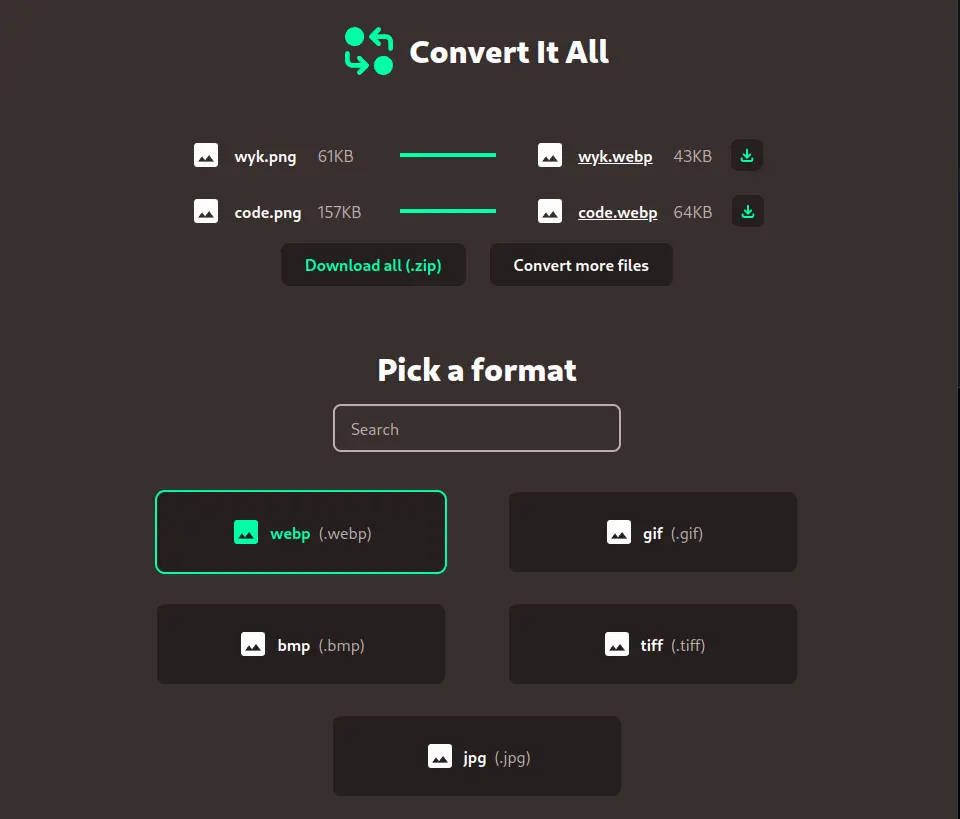

# Convert It All Web

The web app is available here: [https://trzcin.github.io/convert/](https://trzcin.github.io/convert/)

## Description

Convert between file formats locally. The uploaded files are not sent to any remote server.

## Features

-   file picker and drag and drop support for uploading files
-   convert multiple files at the same time
-   uploaded files can be in different formats, as long as they can be converted into the same output format
-   download multiple converted files as a `zip` archive
-   preview converted files in the browser
-   compare file sizes of various formats

## Used technologies

Most conversions are possible in the browser thanks to WebAssembly. The following libraries were used:

-   [ffmpeg.wasm](https://github.com/ffmpegwasm/ffmpeg.wasm) - multimedia conversions (image, video, audio)
-   [pandoc-wasm](https://www.npmjs.com/package/pandoc-wasm) - document conversions (markdown, latex, html, pdf ...)
-   [yaml](https://www.npmjs.com/package/yaml) - converting between yaml/json
